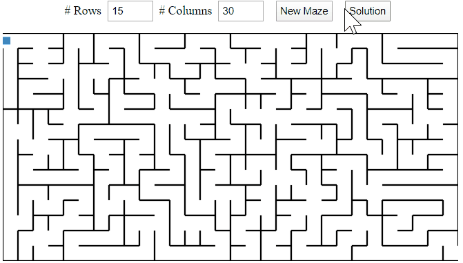

# Maze Generator and Solver in Angular

## [Demo](https://changhuixu.github.io/angular-maze/)

## [Medium Article]()

Maze is generated using _hunt-and-kill_ algorithm.

Path finding is based on _depth-first search_ algorithm.

Drawing is based on canvas.

